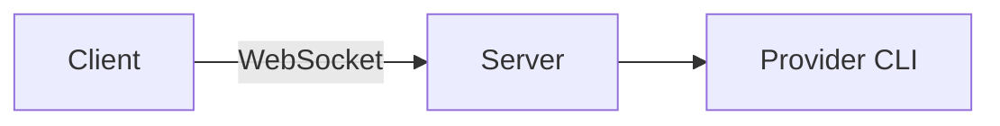

# Diagrams in chat

An agent can answer with a diagram instead of a wall of text. Any code fence tagged
`mermaid` renders as a drawing in the conversation:

````markdown

````

Ask for one the way you would ask for anything else — "draw me the request flow", "diagram
how these modules depend on each other". [Mermaid](https://mermaid.js.org/) covers flowcharts,
sequence diagrams, state machines, entity relationships, class diagrams, Gantt charts, and
more, and every agent T3 Code supports already knows the syntax.

Diagrams follow your theme, and the block header carries two actions:

- **Show diagram source** flips between the drawing and the Mermaid text behind it.
- **Copy diagram source** puts that text on the clipboard, ready to paste anywhere else that
  speaks Mermaid.

While a reply is still streaming the block shows its source and redraws each time the diagram
stops changing, so a long diagram takes shape as it arrives rather than flickering. A fence
whose syntax Mermaid cannot parse stays a normal code block and is marked **unrenderable** —
hover the marker for the reason.

Screenshots and other images work differently: an agent writes the file into the workspace and
links it as an ordinary markdown image.

Diagrams render on the web and desktop apps. On mobile a `mermaid` fence stays a code block.
